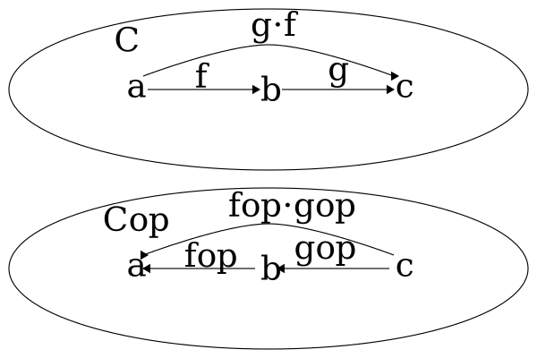
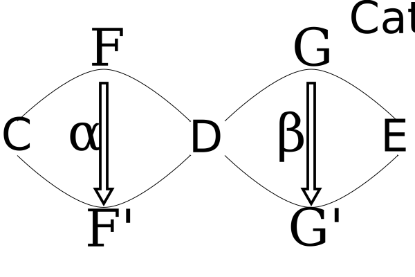
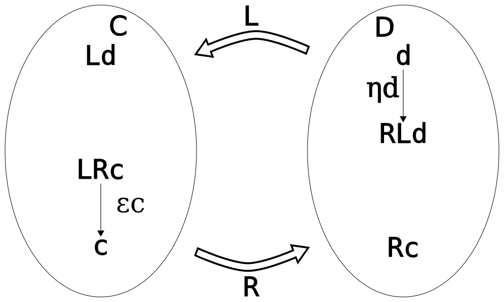
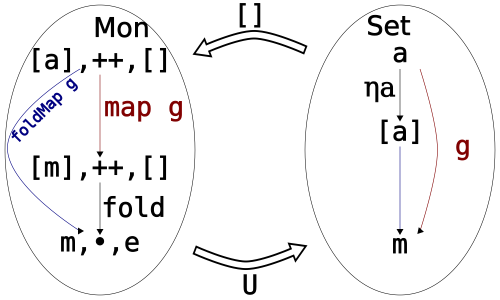
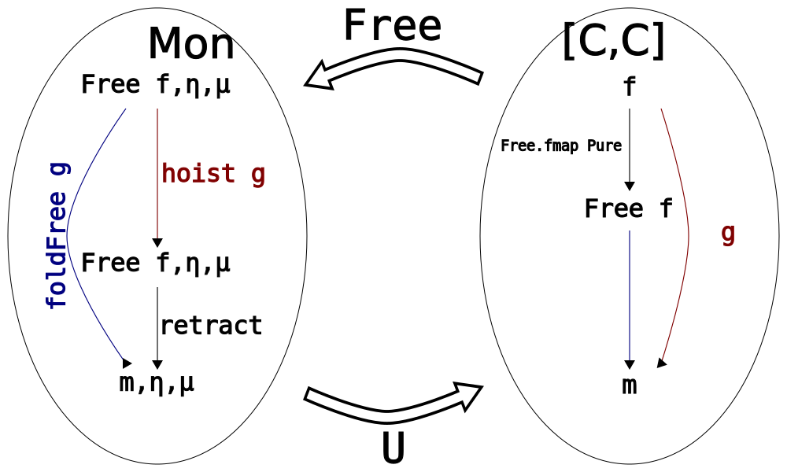

# Categories


A **category** consists of

- a collection of objects x, y, z,.. 
- a collection of morphisms f, g, h,...

so that

- Each morphism has a specified domain and codomain among the collection of ob-
jects. The notation $f : x → y$ signifies that $f$ is a morphism with domain $x$ and
codomain $y$.
- Each object has a designated identity morphism $id_y : y → y$.
- For any composable pair of morphisms, i.e., for any pair f, g with the codomain of
f equal to the domain of g, there exists a specified composite morphism $g⋅f$,

such that the composition is associative ($(h⋅g)⋅f=h⋅(g⋅f)$) and identity is
the neutral element of it ($id⋅f=f$, $g⋅id=g$)

# Opposite category



Given a category $C$, the **opposite category** $C^{op}$ is defined as follows:
its objects are the same as objects of $C$ and its morphisms are reversed
morphisms of $C$ (have their domains and codomains swapped).

Also the composition in $C^{op}$ is reversed: for a morphism $g⋅f$ in $C$
we have $f^{op}⋅g^{op}$ in $C^{op}$.

# Product category


Given two categories $C$ and $D$ the **product category** $CxD$ is defined as follows:

- its objects $<c,d>$ are all possible pairs of objects from $C$ and $D$
- its morphisms $<f,g>$ are all possible pairs of morphisms from $C$ and $D$.

Identity and composition are defined component-wise.

# Functors


Given two categories $C$ and $D$, a **functor** $F: C → D$ is two functions:

- a mapping of objects such that for any $c \in C$ there is an object $Fc \in D$
- a mapping of morphisms: for any $a, b \in C$ and a morphism $f: a → b$
there is a morphism in $D$ denoted $Ff: Fa → Fb$

such that identities and compositions are preserved: ${F} {id} = id$, $F (g⋅f) = Fg ⋅ Ff$

# Important special kinds of functors

- Given a category $C$ a functor $F: C → C$ is called an **endofunctor**.
- A functor from an opposite category $F: C^{op} → D$ is called a **contravariant functor**.
- A functor from a regular (neiter opposite nor a product) is sometimes called a **covariant functor**.
In practice we usually do not expicitly mention the morphism of $C^{op}$,
describing a mapping of morphisms from $C$ directly instead.
- A functor from a product category $F: CxD → E$ is called a **bifunctor**.
It is possible to get new functors by fixing an object from a component of the product.
- A functor of the kind $F: C^{op}xD → Set$ is called a **profunctor**. Important profunctors:
  - $Hom(-, =): C^{op}xC → Set$ that sends a pair of objects $a$ and $b$ in $C$
    to the set of morphisms $Hom(a, b)$ and sends a pair of morphisms $<f, h>$
    to the function on hom-sets defined as $g → h⋅g⋅f$
  - A generalization $Hom(F-, G=)$ is possible where both $F$ and $G$ are covariant.
    It sends pairs of objects $<a, b>$ to $Hom(Fa, Gb)$ and pairs of morphisms $<f, h>$
    to functions $g → Gh⋅g⋅Ff$

# Natural transformations


Given two categories $C$ and $D$ and two functors $F, G: C → D$
a **natural transformation** $α$ is a family of morphisms such as $α_x$ (known as the component of $α$ at $x$)
for any object $x \in C$ such that the following condition holds
for any $a, b \in C$ and $f \in Hom(a, b)$, known as the naturality square:

$α_b⋅Ff = Gf ⋅ α_a$

Given several functors $F, G, H: C → D$ and composable pairs of natural transformations
$α: F → G$, $β: G → H$, identity natural transformations for every functor and compositions
of natural transformations (called "vertical compositions") can be defined.

# Horizontal composition of natural transformations



Given categories $C$, $D$, $E$, functors $F, F': C → D$ and $G, G': D → E$
it is possible to define **horizontal composition** of
natural transformations $α: F → F'$ and $β: G → G'$
written as $β∘α$ (a natural transformation itself).

Its components are given in one of two equivalent ways
$(β∘α)_x = β_{F'x}⋅G(α_x) = G'(α_x)⋅β_{Fx}$

There are important special cases if one of the natural transformation is an identity:

- if $α = F$ then $(β∘F)_x = {β}_{Fx}$
- if $β = G$ then $(G∘α)_x = G({α}_{x})$

# Monads and comonads

- A monad over category $C$ is a triple of $(M: C → C, η: I → M, μ: MM → M)$
  - such that $μ⋅(η∘M) = μ⋅(M∘η) = M$ and $μ⋅(μ∘M) = μ⋅(M∘μ)$
- A comonad over category $C$ is a triple of $(W: C → C, ε: W → I, δ: W → WW)$
  - such that $(ε∘W)⋅δ = (W∘ε)⋅δ = W$ and $(δ∘W)⋅δ = (W∘δ)⋅δ$

# Adjunctions as hom-set isomoprhisms


**Definition A1**: An adjunction between functors $L: C → D$ and $R: D → C$ (denoted $L ⊣ R$) is
a natural isomorphism of hom-sets $C(Ld,c)$ and $D(c,Rd)$

$φ_{d,c}(f) = g$ is called the right adjunct of $f$

$ψ_{d,c}(g) = f$ is called the left adjunct of $g$

# Adjunctions as unit and counit



**Definition A2**: An adjunction between functors `L: C → D` and `R: D → C`
is a pair of natural transformations

$η: I_D → R ∘ L$, called unit,

$ε: L ∘ R → I_C$, called counit,

such that the following identities hold: $ε∘L⋅L∘η = L$, $R∘ε⋅η∘R$,
known as the triangle identities

# Unit-counit to hom-set isomorphism


2 → 1: Given the natural transformations $η$ and $ε$,
the hom-set isomorphism is obtained as

$φ_{d,c}(f) = Rf⋅η_d$,

$ψ{d,c}(g) = ε_c⋅Lg$.

# Hom-set isomorphism to unit-counit


1 → 2: Given the natural transformation $φ$,
the unit of the adjunction is obtained as follows:

Set $c = Ld$ in the previous diagram and consider
the isomorphishm between hom-sets $C(Ld,Ld)$ and $D(d,RLd)$.

There is always at least one morphism in $C(Ld,Ld)$ called $id_{Ld}$,
it corresponds to the component of the unit $η_d ∈ D(d,RLd)$.

Thus for any $d ∈ D$, $η_d = φ_{d,Ld}(id_{Ld})$

# Hom-set isomorphism to unit-counit


1 → 2: Given the natural transformation $ψ$,
the counit of the adjunction is obtained as follows:

Set $d = Rc$ in the previous diagram and consider
the isomorphishm between hom-sets $D(Rc,Rc)$ and $C(LRc,c)$.

There is always at least one morphism in $D(Rc,Rc)$ called $id_{Rc}$,
it corresponds to the component of the counit $ε_c ∈ C(LRc,c)$.

Thus for any $c ∈ C$, $ε_d = ψ_{Rc,c}(id_{Rc})$

# Monad and comonad

Every adjunction $L⊣R$ induces

- a monad $(RL, η: I → RL, R∘ε∘L: RLRL → RL)$
- a comonad $(LR, ε: LR → I, L∘η∘R: LR → LRLR)$

# Categorical product


**The product (bi)functor is defined as the right adjoint to the diagonal functor: $Δ⊣×$.**

The traditional definition of the product object is as follows:

A product of two objects $a$ and $b$ is the object $a×b$
equipped with two projections $π_1$ and $π_2$

such that for any other object $d$ equipped with two projections $f_1$ and $f_2$
there is a unique morphism $g$ that factorizes those projections:
$<f_1,f_2> = <π_1,π_2> ⋅ Δg$

# Categorical sum


**The coproduct (bi)functor is defined as the left adjoint to the diagonal functor: $+⊣Δ$.**

The traditional definition of the coproduct object is as follows:

A coproduct of two objects $a$ and $b$ is the object $a+b$
equipped with two injections $i_1$ and $i_2$

such that for any other object $c$ equipped with two projections $g_1$ and $g_2$
there is a unique morphism $f$ that factorizes those projections:
$<g_1,g_2> = Δf ⋅ <π_1,π_2>$

# Categorical exponential


**The functor of exponentiation to $s$ is defined as the right adjoint
to the functor of product with $s$:
$-×s⊣s⇒-$.  **

When $C$ is $Set$ (or $Hask$):

- $φ$ is `curry`
- $ψ$ is `uncurry`
- $η$ is the unit of the `State s` monad
- $ε$ is the counit of the `Store s` comonad
- $ε$ is also `uncurry ($)`, function application

# Free monoid



**The free monoid on a set $a$ is defined as the image of $a$
under the left adjoint to the functor $U$ that forgets the monoidal structure.**

Traditional definition: the free monoid over set $a$ is $[a]$
(together with the function $η_a$) if and only if there is a unique morphism `foldMap g`
to any other monoid m (together with the function g) that satisfies
the factorization property: $g = foldMap g . η_a$

# List is not a free monoid

Lists and `Seq`s and `Vector`s should all be free monoids but unfortunately
they are not since each of them [behaves differently for infinite sequences](http://comonad.com/reader/2015/free-monoids-in-haskell/).

Here is the actual [free monoid](https://gist.github.com/prutz1311/fdd11a5374038c5957d701c32d8d98c0):

```haskell
newtype FM a = FM { unFM :: forall m. Monoid m => (a -> m) -> m }

embed :: forall a. a -> FM a
embed x = FM $ \k -> k x

instance Semigroup (FM a) where
  (<>) :: FM a -> FM a -> FM a
  FM e1 <> FM e2 = FM $ \k -> e1 k <> e2 k

instance Monoid (FM a) where
  mempty :: FM a
  mempty = FM $ \_ -> mempty

instance Foldable FM where
  foldMap :: forall m a. Monoid m => (a -> m) -> FM a -> m
  foldMap f (FM e) = e f
```

# List is not a free monoid


# Free monad



The free monad for a functor $f$ is its image under the left adjoint
to the functor that forgets the monadic structure.

# Cofree comonad


The cofree comonad for a functor $f$ is its image under the right adjoint
to the functor that forgets the comonadic structure.

# Conclusion

A lot of concepts are adjunctions.


> The slogan is "Adjoint functors arise everywhere".
  - Saunders Mac Lane, "Categories for the Working Mathematician"

<script defer src=adjunctions.js></script>
</script>
<link rel="stylesheet" href="/home/oleg/junk/rjs/reveal.js-master/dist/theme/white.css" />
<style type="text/css">
:root { --r-heading-text-transform: none; --r-main-font-size: 20px; --r-heading1-size: 48px; }
h1 { text-transform: lowercase; }
p { text-align: left; }
ul { text-align: left; }
li { text-align: left; }
img.center {
    display: block;
    margin-left: auto;
    margin-right: auto; 
}
code { font-size: 18px; }
</style>
